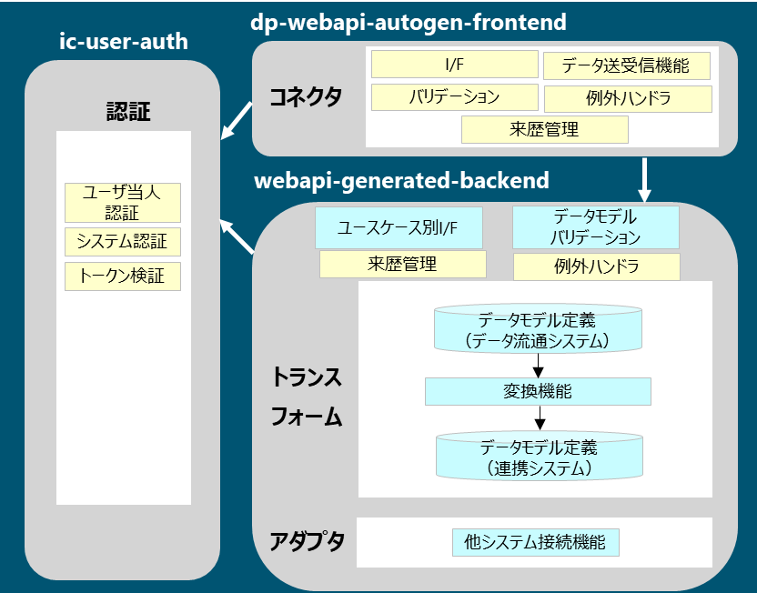

## 概要
本リポジトリは、デジタルライフライン全国総合整備計画（2024年度）における実証用の資材である。  
最新の参照実装は[WebAPI転送モジュール版](https://github.com/ODS-DFS-L2/dp-webapi-autogen)に移行しており、本リポジトリは非推奨（deprecated）となる。  
また、本リポジトリは「ドローン航路システム」用のリポジトリである。  

以下、アーキテクチャ概要を示す。  


データの受け渡しは、```dp-webapi-autogen-frontend```（コネクタ）と```webapi-generated-backend```（アダプタ、トランスフォーム）の2つのコンポーネントで構成されており、各コンポーネントが```ic-user-auth```（ユーザ認証システム）と通信して認証を実施する。  
動作は```dp-webapi-autogen-frontend``` 、```webapi-generated-backend``` 、```ic-user-auth```の3つのコンポーネントの起動を前提とする。  

- [dp-webapi-autogen-frontend](https://github.com/ODS-DFS-L2/dp-webapi-autogen-frontend)  

- webapi-generated-backend-UASL（**本リポジトリ**）

- [ic-user-auth](https://github.com/ODS-DFS-L3/ic-user-auth)

## 動作確認済み実行環境
|Name                                        |Version |
|:-------------------------------------------|:-------|
|java                                      |21|
|apache-maven                              |3.9.8|

## ビルド・起動手順
### 1. 環境変数の設定
起動時に設定が必要となる環境変数を設定する。環境変数は以下の4つとなる。  
|環境変数                |説明 |例 |
|:-------------------------------------------|:-------|:-------|
|SERVER_PORT                 |webapi-generated-backendのサーバーポート |18090 |
|TRUSTSYSTEM_BASEURL         |連携システムの接続URL |https://UASL |
|API_KEY                     |APIキー |Sample-APIKey1 |
|AUTH_URL                    |ic-user-authのトークンイントロスペクションAPIのURL |http://localhost:8081/api/v2/systemAuth/token |

### 2. jarファイルの生成
以下のコマンドを実行し、jarファイルを生成する。  
※ ```path/to/webapi-generated-backend``` はローカル環境に ```git clone``` された```webapi-generated-backend-UASL```へのパスを表す。
```shell
cd <path/to/webapi-generated-backend>
$ mvn clean install -DskipTests=true
```

### 3. jarファイルの実行
以下のコマンドを実行し、jarファイルを実行する。
```shell
cd <path/to/webapi-generated-backend>
$ java -jar backend/target/backend-0.0.1-SNAPSHOT.jar
```

# ライセンス
- 本リポジトリはMITライセンスで提供されています。
- ソースコードおよび関連ドキュメントの著作権は株式会社NTTデータグループ、株式会社NTTデータに帰属します。

# 免責事項
- 本リポジトリの内容は予告なく変更・削除する可能性があります。
- 本リポジトリの利用により生じた損失及び損害等について、いかなる責任も負わないものとします。
